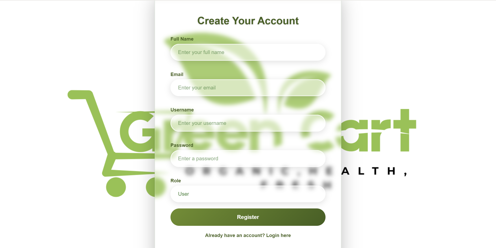
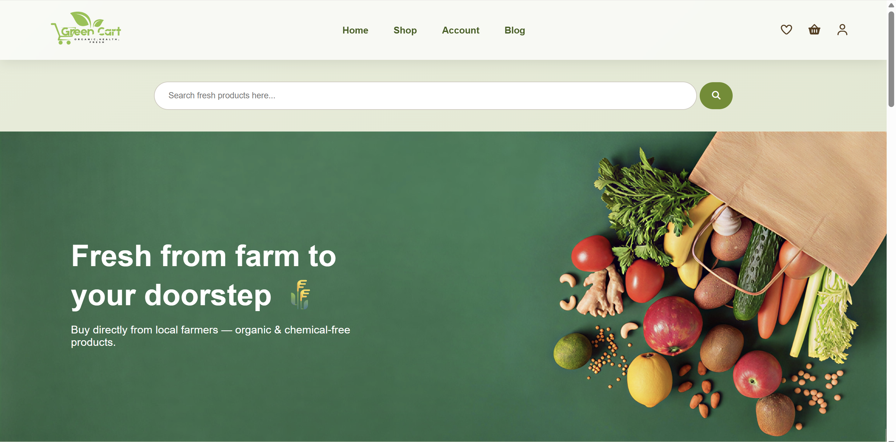
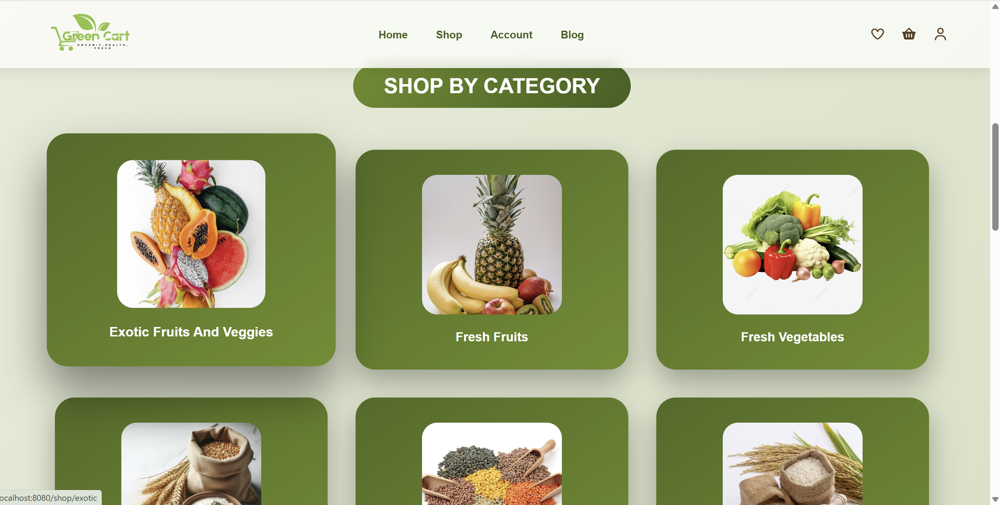
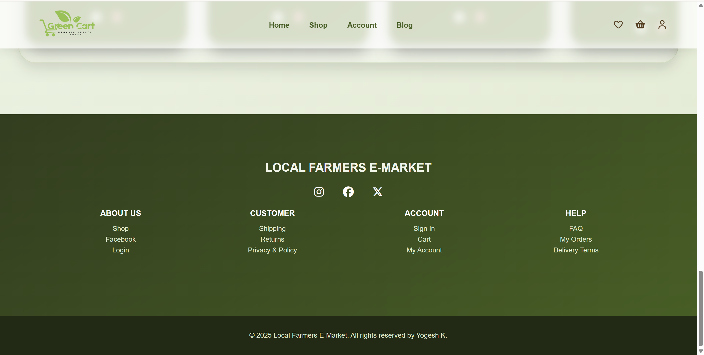
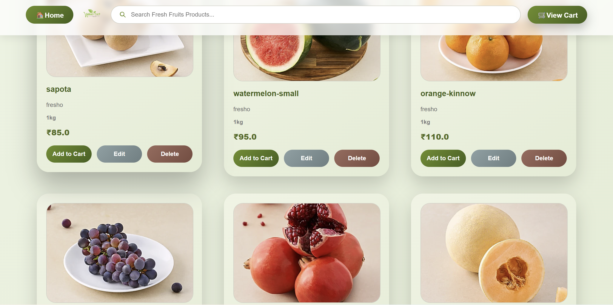

# Local Farmers E-Market

A Spring Boot–based full-stack web application that connects local farmers’ products directly with consumers, enabling secure online buying and selling of fresh agricultural produce.

This project is designed as a simple e-commerce-style platform that allows customers to browse products, manage carts, and place orders through a clean and secure web interface.

---

## 🚀 Features

- User registration and login

- Role-based access (Admin / User)

- Product listing and management (Admin)

- Dynamic shopping cart using AJAX

- Secure checkout flow

- Responsive UI with modern CSS animations

---

# 🛠️ Tech Stack

- **Backend:** Java, Spring Boot, Spring MVC

- **Security:** Spring Security, BCrypt

- **Frontend:** Thymeleaf, HTML5, CSS3, JavaScript, jQuery, AJAX

- **Database:** MySQL

- **Build Tool:** Maven

- **Java Version:** Java 17+

---

# 📂 Project Structure
<pre>
Local-Farmers-E-Market/
├── src/main/java
│   ├── controller
│   ├── service
│   ├── repository
│   ├── model
│   └── security
├── src/main/resources
│   ├── templates
│   ├── static
│   └── application.properties
├── screenshots
│   ├── login.png
│   ├── register.png
│   ├── home-1.png
│   ├── home-2.png
│   ├── home-3.png
│   ├── home-4.png
│   ├── categories.png
│   ├── categories-1.png
│   ├── categories-2.png
│   ├── categories-3.png
│   ├── cart.png
│   ├── cart-1.png
│   └── order-page.png
├── pom.xml
└── README.md
</pre>

---

# 🔐 Security

- Spring Security–based authentication

- BCrypt password encryption

- Role-based access control

- Admin-only product and category management

---

## 📸 Screenshots

### 🔑 Login Page

### 📝 Registration Page

### 🏠 Home Page

 

### 📂 Categories

 

 

 

### 🛒 Cart Page

 

### ✅ Order Completion Page

---

## ▶️ How to Run the Project
1️⃣ Clone the repository
git clone https://github.com/mkyogesh/Local-Farmers-E-Market.git

2️⃣ Configure database (application.properties)
spring.application.name=localfarmersemarket

spring.datasource.url=jdbc:mysql://localhost:3306/emarket
spring.datasource.username=root
spring.datasource.password=root
spring.datasource.driver-class-name=com.mysql.cj.jdbc.Driver

spring.jpa.hibernate.ddl-auto=update
spring.jpa.show-sql=true

spring.servlet.multipart.max-file-size=10MB
spring.servlet.multipart.max-request-size=10MB

3️⃣ Run the application
mvn spring-boot:run

4️⃣ Open in browser
http://localhost:8080

👨‍💻 Author

Yogesh